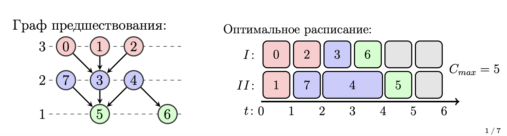

# Задача теории расписания
Две машины параллельно выполняют набор работ разной сложности.
Граф предшествования задаёт условие что одни работы должны
выполняться позже других. Решением задачи является расписание
работ на машинах



## Алгоритмы 

### Coffman

Жадный алгоритм, назначает задачи на процессоры как можно раньше, соблюдая зависимости.

[code](coffman.py)

### Fujii

Выбирает задачи с наибольшим числом зависимых задач, чтобы быстрее освободить ресурсы.

[code](fujii.py)

### Sethi

Назначает задачи, минимизируя пиковое использование регистров (или памяти) с помощью эвристики глубины.

[code](sethi.py)

### Gabow

Находит циклы и сильно связные компоненты в графе зависимостей за линейное время.

[code](gabow.py)


## Api

```
uvicorn api:app --reload
```

Docs and Swagger will be available on http://127.0.0.1:8000/docs


## Dependencies

python3.11 + [reqs](requirements.txt)

